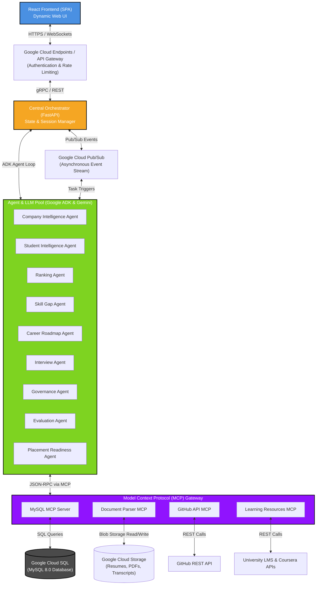
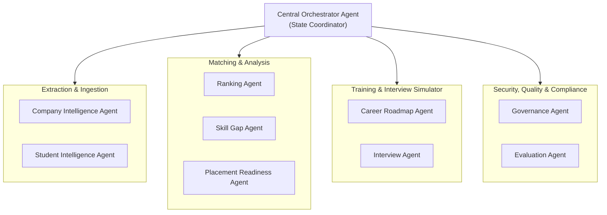
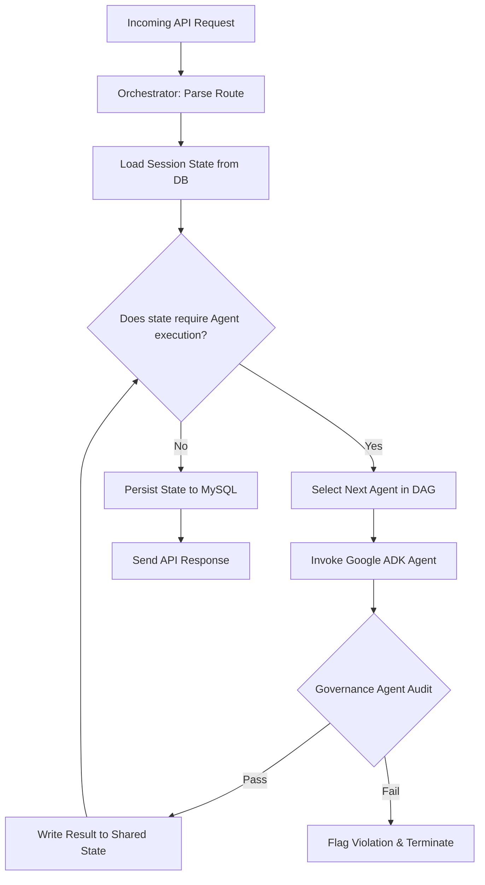
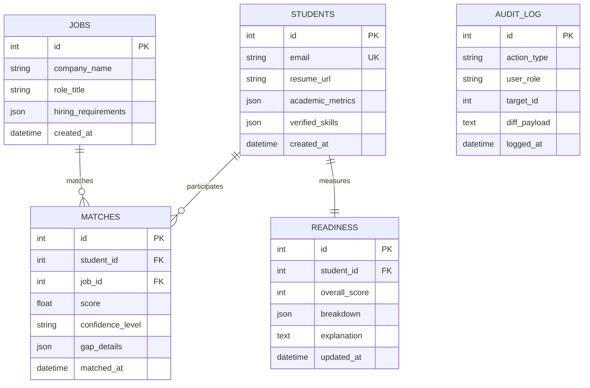
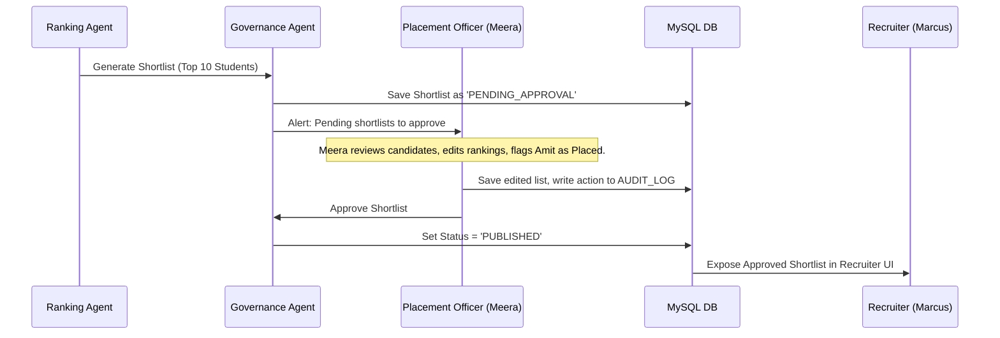
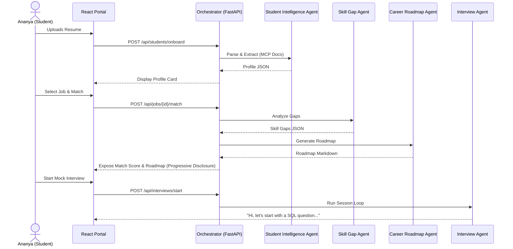
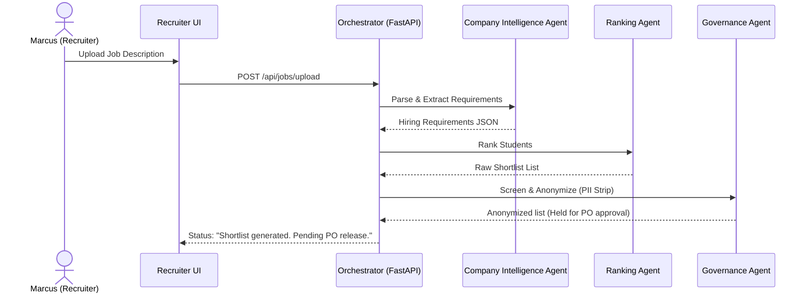
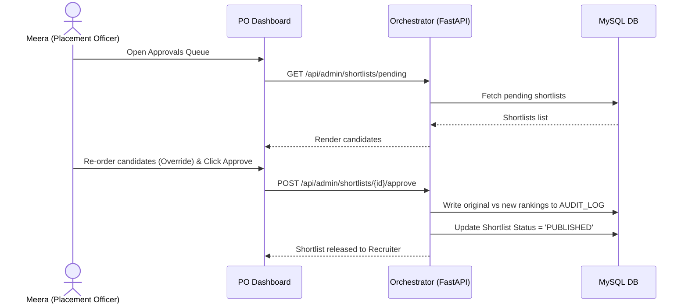

# Technical Architecture Document: Placement Intelligence Platform (PIP)
## Distributed Systems Design, Multi-Agent Topologies, and Google ADK Implementation Spec

---

## 1. High-Level System Architecture

The Placement Intelligence Platform (PIP) is built on a modern event-driven, microservices-based architecture that separates the web-based presentation layer, the central orchestrator, a cluster of specialized AI agents, and a suite of Model Context Protocol (MCP) integrations.



### Why it exists
This architecture provides a scalable, decoupled environment where the heavy, long-running agent workloads (such as running interviews or parsing PDFs) are separated from the synchronous web APIs. It ensures that UI operations remain highly responsive.

### What problem it solves
It solves the performance bottleneck of orchestrating multiple LLM requests. By utilizing asynchronous messaging and micro-services, the frontend can query statuses while backend agents complete multi-step reasoning cycles.

### Kaggle Concept
*   **Day 1 (Agentic Engineering & Multi-Agent Systems):** Separation of worker agents from orchestration.
*   **Day 2 (MCP):** Centralizing data access tools under standard protocol schemas.
*   **Day 5 (Cloud Deployment):** Containerized execution using Cloud Run and Cloud SQL.

---

## 2. User Role Architecture

The system segregates dashboards and data views based on four primary user roles, strictly enforcing Role-Based Access Control (RBAC) at the API Gateway level.

```
       +-----------------------------------------------------------------+
       |                          API Gateway                            |
       +-----------------------------------------------------------------+
                                       |
          +----------------------------+----------------------------+
          v                            v                            v
  [ Student Dashboard ]      [ Recruiter Portal ]       [ Admin/PO Portal ]
   - Upload Resumes           - Upload JDs               - Approve Shortlists
   - View Roadmaps            - View Rankings            - Audit Trail Viewer
   - Run Mock Interviews      - Adjust Match Weights     - Institutional Analytics
```

*   **Student (Ananya):** Has read/write access to their own profile, resumes, learning roadmap progress, and mock interview transcripts. Cannot access details of other students or raw recruiter dashboards.
*   **Recruiter (Marcus):** Has read/write access to their posted Job Descriptions and read-only access to approved student rankings. Cannot view student resumes directly (masked by the Governance Agent to prevent bias) until after shortlist approval.
*   **Faculty (Dr. Ramesh):** Has access to aggregate department analytics, common skill deficiencies, and curriculum impact stats. Cannot view individual student records without explicit dean approval.
*   **Placement Officer (Meera):** Super-user. Has full access to student readiness pipelines, approvals lists, custom weight tuning metrics, and the immutable security audit log.

### Kaggle Concept
*   **Day 4 (Security & Effective Trust):** Implementing RBAC to protect private student information (PII) and grading transcripts.

---

## 3. Agent Architecture

PIP implements a **Hierarchical Multi-Agent Topology** where workers report directly to a master Orchestrator. Cross-agent communication is coordinated by the orchestrator via a message bus.



### Why it exists
Each agent has a constrained system prompt, a focused list of tools, and a distinct evaluation metric. This prevents "context explosion" and prompt confusion, keeping LLM latency down and accuracy high.

### Kaggle Concept
*   **Day 1 (Factory Model & Multi-Agent Systems):** Building dedicated agents instead of one large monolith prompt.

---

## 4. Agent Responsibilities

The Placement Intelligence Platform coordinates nine agents, each built using the **Google ADK Agent class**:

| # | Agent Name | Core Responsibility | Primary Tools Used | Output Type |
| :--- | :--- | :--- | :--- | :--- |
| **1** | **Company Intelligence Agent** | Converts raw JD text/PDF into a structured hiring requirement file. | `Doc_MCP.parse_pdf` | JSON Schema (`hiring_requirement.json`) |
| **2** | **Student Intelligence Agent** | Parses resumes, parses portfolio documents, scans public GitHub data (optional). | `Doc_MCP.parse_pdf`, `GH_MCP.get_repos` | JSON Schema (`student_profile.json`) |
| **3** | **Ranking Agent** | Computes match rankings, executes What-If skill simulation matrix runs. | `DB_MCP.fetch_profiles` | Ranked List Array |
| **4** | **Skill Gap Agent** | Pinpoints discrepancies between a student's skills and a JD's requirements. | None (Direct Comparison) | Structured Gap Matrix |
| **5** | **Career Roadmap Agent** | Generates sequenced learning paths utilizing internal and external materials. | `Ed_MCP.search_courses` | Markdown Roadmap (`roadmap.json`) |
| **6** | **Interview Agent** | Runs mock interview loops, scores answers, generates question trees. | None (Chat Session State) | Scorecard Metrics (`interview_score.json`) |
| **7** | **Governance Agent** | Sanitizes user inputs, masks PII, intercepts shortlists, writes audit logs. | `DB_MCP.log_audit` | Boolean Pass/Fail + Redacted Data |
| **8** | **Evaluation Agent** | Runs LLM-as-a-judge reviews of match justifications, checks accuracy metrics. | None (Cross-Model Evaluation) | Quality Logs & NDCG Reports |
| **9** | **Placement Readiness Agent**| Computes aggregate readiness scores (0-100) based on tech, projects, and interviews. | `DB_MCP.fetch_grades` | Score Breakdown + Explanations |

---

## 5. Agent Communication Design (A2A)

Agents do not write directly to each other's memory. Instead, they communicate using **Structured Data Payloads** via a centralized **Shared State Dictionary (Board Pattern)** managed by the Orchestrator.

```
       +-----------------------------------------------------------------+
       |                         Shared State                            |
       |  - session_id: UUID                                             |
       |  - student_profile: JSON                                        |
       |  - hiring_requirements: JSON                                    |
       |  - match_ranking: List                                          |
       |  - skill_gaps: List                                             |
       +-----------------------------------------------------------------+
           ^                     |                     ^             |
   Write   |             Read    |             Write   |       Read  |
  Profile  |            Profile  v             Ranking |       Gaps  v
+------------------+     +-----------------+     +-----------------+     +-----------------+
|  Student Agent   |     |  Ranking Agent  |     |  Gov Agent      |     | Skill Gap Agent |
+------------------+     +-----------------+     +-----------------+     +-----------------+
```

### Payload Protocol
All messages are serialized as JSON payloads conforming to pre-defined specs (Day 5 Spec-Driven Development).
*   **Format:** `{"source_agent": "student_intelligence", "target_agent": "ranking_agent", "payload_type": "profile_match_request", "payload": { ... }}`

### Kaggle Concept
*   **Day 2 (Agent-to-Agent Communication):** Standardized JSON payloads passing through structured API contracts instead of unstructured text streams.

---

## 6. Orchestrator Design

The Orchestrator manages the execution lifecycle of tasks, maintaining state and session routing. 



### State Management
Session state is backed by MySQL and cached in Redis. The orchestrator exposes a `context_id` that links all agent runs for a specific interaction (e.g., a student requesting a mock interview).

---

## 7. Workflow Engine Design

The workflow engine runs on **Google Cloud Pub/Sub** and **FastAPI Tasks**. It coordinates complex multi-step pipelines as Directed Acyclic Graphs (DAGs).

```
                      +-----------------------------+
                      |    Resume Upload Event      |
                      +-----------------------------+
                                     |
                                     v
                      +-----------------------------+
                      |   Student Intel Agent Run   |
                      +-----------------------------+
                                     |
                                     v
                      +-----------------------------+
                      |   Governance Anonymizer     |
                      +-----------------------------+
                                     |
                     +---------------+---------------+
                     |                               |
                     v                               v
       +---------------------------+   +---------------------------+
       |    Readiness Agent Run    |   |     Ranking Agent Run     |
       +---------------------------+   +---------------------------+
                     |                               |
                     +---------------+---------------+
                                     |
                                     v
                      +-----------------------------+
                      |  Evaluation Agent QA Check  |
                      +-----------------------------+
```

### Handling Failures
*   **Transient Failures (Rate limits):** Exponential backoff with jitter configured in the Google ADK LLM client.
*   **Hard Failures:** If an agent execution fails twice, the orchestrator rolls back the session state, flags an error in the UI via WebSockets, and alerts the monitoring framework.

---

## 8. MCP Architecture

Model Context Protocol (MCP) acts as the secure gatekeeper between our AI agents and external/internal data resources.

```
       +------------------------------------+
       |          Google ADK Agent          |
       +------------------------------------+
                         |
                         | JSON-RPC over Stdout/WebSockets
                         v
       +------------------------------------+
       |            MCP Gateway             |
       +------------------------------------+
         |             |              |
         | mysql://    | https://     | https://
         v             v              v
      [MySQL]      [GitHub]      [LMS / Coursera]
```

### GitHub and Portfolio Integration
1.  **Resume Ingestion:** `Doc_MCP` extracts details from uploaded files.
2.  **Portfolio Document Parsing:** If a student uploads project reports (e.g., PDF architecture designs), the `Doc_MCP` runs structured text extraction and searches for code snippets, database diagrams, or architectural patterns.
3.  **GitHub Verification (Optional):**
    *   If a student provides a GitHub URL, `GH_MCP` runs repository verification (fetching commit counts, verifying language distributions, analyzing complex file trees).
    *   If *not* provided, the system marks the GitHub fields as `UNVERIFIED` and increases reliance on academic records and parsed portfolio documents. The `Placement Readiness Agent` reflects this by noting *"Project Verification: Document-based"* instead of *"Project Verification: Source Code Verified"*.

### Kaggle Concept
*   **Day 2 (Model Context Protocol):** Standardized, protocol-based tool access decoupling agents from database queries and external APIs.

---

## 9. Skill Architecture

In the Google ADK framework, a **Skill** represents a reusable tool wrapper or sub-agent routine. 

```
/skills
  ├── /resume_parsing_skill
  │     ├── skill.py         # Google ADK Skill implementation wrapper
  │     ├── prompt.txt       # System prompt specific to parsing resumes
  │     └── schema.json      # Structured extraction JSON schema
  ├── /interview_skill
  │     ├── skill.py
  │     └── questions_bank.db
  └── /what_if_simulator_skill
        └── skill.py
```

*   **Definition:** Skills inherit from `adk.Skill`. They expose tools to the agents.
*   **Reusability:** The `resume_parsing_skill` is used by the `Student Intelligence Agent` for student onboarding, and can be reused by the `Placement Officer` to batch-upload legacy student archives.

### Kaggle Concept
*   **Day 3 (Agent Skills):** Creating modular, reusable blocks of behavior rather than hardcoding capabilities within specific agent classes.

---

## 10. Database Schema Design

MySQL 8.0 holds the structured state of the system. High-performance JSON fields are used to store structured profile details.



### Kaggle Concept
*   **Day 4 (Human-in-the-Loop & Security):** The `AUDIT_LOG` table acts as a write-only ledger, registering every manual override by placement officers.

---

## 11. API Architecture

The platform uses FastAPI for high-performance async processing. Here are the core endpoint schemas:

### 1. Match Ranking Query
*   **Route:** `POST /api/jobs/{job_id}/rank`
*   **Payload:**
```json
{
  "min_match_score": 70,
  "limit": 20,
  "filter_placed": true
}
```
*   **Response:**
```json
{
  "job_id": 1024,
  "status": "APPROVED",
  "rankings": [
    {
      "rank": 1,
      "student_id": 482,
      "match_score": 92.4,
      "confidence": "HIGH",
      "reasoning": "Candidate has 3 verified React repos matching requirements.",
      "gaps": []
    }
  ]
}
```

### 2. What-If Simulation Query
*   **Route:** `POST /api/students/{student_id}/what-if`
*   **Payload:**
```json
{
  "target_job_id": 1024,
  "skills_to_add": ["Docker", "AWS"]
}
```
*   **Response:**
```json
{
  "student_id": 482,
  "target_job_id": 1024,
  "current_score": 72.0,
  "simulated_score": 93.5,
  "gaps_resolved": ["Docker", "AWS (Basic)"],
  "explanation": "Adding Docker satisfies the containerization requirement. Adding AWS resolves the cloud hosting skill deficit."
}
```

---

## 12. Frontend Architecture

The React 18 frontend is organized around modules representing distinct agent UI interactions, strictly applying **Progressive Disclosure**.

```
/src
  ├── /components
  │     ├── /ReadinessCard       # Displays score + click to expand breakdown
  │     ├── /MatchViewer         # Shows match score -> opens gap analysis
  │     └── /InteractiveRoadmap  # Displays step-by-step learning cards
  ├── /context
  │     └── AuthContext.js       # Manages JWT token and RBAC roles
  └── /views
        ├── StudentPortal.jsx
        ├── RecruiterPortal.jsx
        └── AdminPortal.jsx
```

### Progressive Disclosure Flow
1.  **Initial View:** Student sees a dashboard showing target jobs with simple match cards: *"Software Dev Intern - Match: 75%"*.
2.  **Step 2 (Expose Gaps):** Student clicks the card. The UI slides open to show a visual comparison bar of matched vs missing skills (generated by the `Skill Gap Agent`).
3.  **Step 3 (Expose Roadmap):** Student clicks *"How do I fix this?"*. The UI requests the roadmap, rendering a weekly checklist.
4.  **Step 4 (Launch Mock Interview):** Student clicks *"Start Mock Interview"* on a roadmap milestone card, launching a full-screen interactive chatbot connected directly to the `Interview Agent`.

### Kaggle Concept
*   **Day 3 (Progressive Disclosure):** Structuring user interface flows to disclose complex agent analysis results sequentially rather than all at once.

---

## 13. Security Architecture

PIP builds security directly into the data pathways:

```
               [ User Input ]
                     |
                     v
       +---------------------------+
       |   Anti-Injection Filter   | --> (Regex / Semantic Check)
       +---------------------------+
                     |
                     v
       +---------------------------+
       |    Anonymization Engine   | --> (Strip PII: Name, Email)
       +---------------------------+
                     |
                     v
       +---------------------------+
       |     ADK Agent Execution   |
       +---------------------------+
```

*   **PII Masking:** Before transmitting student data to matching or ranking APIs, the API wrapper removes student names, emails, gender, and phone numbers. The `Ranking Agent` evaluates data anonymously, matching by UUID.
*   **Prompt Injection Protection:** The gateway inspects all input parameters for known injection sequences using system guardrails.
*   **Agent Sandboxing:** External MCP tools (like running code verification) execute in isolated containers with temporary directory mounts.

---

## 14. Governance Architecture

The **Governance Agent** enforces security policies, compliance metrics, and bias detection.

```
       +------------------------------------+
       |         Proposed Shortlist         |
       +------------------------------------+
                         |
                         v
       +------------------------------------+
       |          Governance Agent          |
       +------------------------------------+
          /                                \
         / Bias Detection Check             \ Verification Checklist
        v                                    v
[ Demographic Ratio Check ]        [ Validate Credentials ]
        \                                    /
         \                                  /
          +----------------+---------------+
                           |
                           v
              +--------------------------+
              |    Status: APPROVED/HELD |
              +--------------------------+
```

### Rules Enforced
1.  **Bias Guardrail:** The Governance Agent flags the system if the matching output ratio deviates significantly from demographic norms (e.g., verifying equal opportunity ranking).
2.  **Shortlist Interception:** If a ranking query matches candidates for high-value roles, the Governance Agent holds the list, sending it to the Placement Officer queue rather than the recruiter portal.

---

## 15. Human-in-the-Loop Architecture

The platform requires human verification at key check-points.



### Override Mechanisms
*   Placement Officers can drag-and-drop to re-order the matching rankings.
*   The `AUDIT_LOG` stores the exact change: `{"user": "Meera", "action": "rank_override", "job_id": 12, "original_ranking": [4, 8, 15], "new_ranking": [8, 4, 15], "reason": "Amit accepted other offer"}`.

### Kaggle Concept
*   **Day 4 (Human-in-the-Loop & Effective Trust):** Implementing an approval loop and explainability checkpoints to calibrate user trust.

---

## 16. Evaluation Architecture

Evaluation runs continuously to ensure high match quality.

### 1. Offline Golden Dataset Evaluation
We maintain a static dataset of 50 student resumes, 5 job posts, and manual rank mappings verified by senior HR executives. The CI/CD pipeline runs:
$$\text{NDCG}@K = \frac{\text{DCG}@K}{\text{IDCG}@K}$$
Any update to agent prompts that drops NDCG below 0.85 fails the build.

### 2. Online LLM-as-a-Judge
The **Evaluation Agent** runs independent audits on a sample (10%) of active matches:
*   It asks an independent evaluator LLM: *"Based on Resume [UUID] and Job [UUID], score the match explanation from 1 to 5. Verify that no skills are listed as 'matched' if they are missing from the resume."*

---

## 17. Placement Readiness Architecture

The **Placement Readiness Agent** acts as an aggregator of student capability metrics.

### Scoring Algorithm
The overall score is a weighted aggregation of four categories (out of 100):
$$\text{Readiness Score} = 0.30(\text{Technical Skills}) + 0.30(\text{Projects}) + 0.20(\text{Communication}) + 0.20(\text{Interview Performance})$$

```
                   +------------------------------+
                   |   Placement Readiness Score  |
                   |             72 / 100         |
                   +------------------------------+
                                  |
         +------------------------+------------------------+
         |                                                 |
         v                                                 v
 [ Technical: 85/100 ]                            [ Projects: 60/100 ]
 High academic GPA. Verified                      Missing containerization
 databases & Java.                                concepts. No verified code.
         |                                                 |
         +------------------------+------------------------+
         |                                                 |
         v                                                 v
 [ Communication: 78/100 ]                        [ Interview: 65/100 ]
 Good language structure.                         Struggles with system
 Needs concise summaries.                         design questions.
```

### Explainability
Along with the numeric score, the agent outputs a structured JSON response detailing what specific actions will increase the score (e.g., *"Upload a GitHub link containing a Node.js project to increase your Project score by 15 points"*).

---

## 18. What-If Simulation Architecture

The **Ranking Agent** handles the What-If simulation using an in-memory cloning loop.

```
       +------------------------------------+
       |          Original Profile          | --> (Java, SQL)
       +------------------------------------+
                         |
                         v
       +------------------------------------+
       |       Cloned Student Profile       | --> (Add: Docker, AWS)
       +------------------------------------+
                         |
                         v
       +------------------------------------+
       |          Ranking Simulator         |
       +------------------------------------+
         |                                |
         v                                v
  [ Match Score: 72% ]             [ Match Score: 93% ]
```

### Flow of Simulation
1.  **Input:** User selects a job and inputs target skills: `"Docker", "AWS"`.
2.  **Cloning:** The backend retrieves the student's active profile and copies it to a temp memory buffer.
3.  **Appends:** It appends `"Docker"` and `"AWS"` to the cloned profile's `skills` array.
4.  **Re-Run Match:** The orchestrator invokes the `Ranking Agent` using the cloned profile against the target JD.
5.  **Calculate Delta:** The system compares the original score (72%) with the simulated score (93%).
6.  **Explain:** The `Skill Gap Agent` processes the result, verifying that the delta is directly caused by resolving the two missing skills. It outputs the result to the React UI.

---

## 19. Logging and Monitoring

PIP uses **OpenTelemetry** and **Google Cloud Logging** to monitor multi-agent execution graphs.

*   **Execution Tracing:** Every API request is assigned a `trace_id`. Sub-calls to agents inherit this ID, creating a trace graph.
*   **Token Metrics Tracking:** We log input tokens, output tokens, and API costs per agent execution. This allows tracking the cost per matched profile.
*   **Agent Latency Monitoring:** Triggers alerts if any agent execution takes longer than 15 seconds.

---

## 20. Cloud Deployment Architecture

The application is deployed on Google Cloud Platform (GCP) for reliability and scaling:

```
                                  [ React Web UI ]
                                         |
                                         v
                             [ Cloud Run: API Gateway ]
                                         |
                                         v
                         [ Cloud Run: FastAPI Orchestrator ]
                                   |            |
                                   v            v
                       [ Cloud Run: Agent Pool ] [ Cloud SQL (MySQL) ]
                                   |
                                   v
                         [ Cloud Run: MCP Servers ]
```

*   **Google Cloud Run:** Hosts the FastAPI orchestrator, React frontend, and Python-based MCP servers in Docker containers. Cloud Run scales container instances automatically based on CPU usage.
*   **Cloud SQL (MySQL):** Managed relational database with automatic backups and multi-region replication.
*   **Cloud Storage:** Stores raw resumes (PDFs) and mock interview transcript recordings.

---

## 21. Scalability Considerations

*   **LLM Rate Limiting:** We implement a task-queue system using Celery/Redis. If Gemini API rate limits are hit (HTTP 429), tasks are automatically re-queued with exponential backoff.
*   **Caching:** Student profiles, parsed JDs, and simulation outputs are cached in Redis for 1 hour. This avoids re-running expensive LLM pipelines for duplicate page requests.

---

## 22. Sequence Diagrams

### 1. Student Journey (Resume -> Match -> Roadmap -> Mock Interview)



### 2. Recruiter Journey (JD Upload -> Ranking Retrieval)



### 3. Placement Officer Journey (Approval -> Audit)



---

## 23. Folder Structure

PIP is organized as a monorepo, separating frontend code, backend services, agent specifications, and MCP integrations:

```
placement-intelligence-platform/
├── .agents/                    # Workspace agent configurations & rules
├── frontend/                   # React Single Page Application
│   ├── public/
│   └── src/
│       ├── components/         # Reusable widgets (Readiness gauges, etc.)
│       ├── views/              # Pages (Student, Recruiter, Admin Dashboards)
│       └── App.js
├── backend/                    # FastAPI python backend
│   ├── app/
│   │   ├── api/                # REST endpoints
│   │   ├── core/               # Orchestrator & Workflow logic
│   │   ├── db/                 # Database connection & schemas
│   │   └── main.py
│   ├── Dockerfile
│   └── requirements.txt
├── agents/                     # Google ADK Agent Specifications
│   ├── company_agent.py
│   ├── student_agent.py
│   ├── ranking_agent.py
│   ├── gap_agent.py
│   ├── roadmap_agent.py
│   ├── interview_agent.py
│   ├── governance_agent.py
│   ├── evaluation_agent.py
│   └── readiness_agent.py
├── mcp_servers/                # Custom MCP servers
│   ├── mysql_mcp/
│   ├── github_mcp/
│   └── document_parser_mcp/
└── docker-compose.yml          # Local orchestration
```

---

## 24. Recommended ADK Project Structure

Google Agent Development Kit projects utilize dedicated agent and skill definition schemas. Here is the recommended layout for ADK components:

```
/agents
  ├── config.py                 # Central ADK client configuration
  ├── base_agent.py             # Base agent class inheriting from ADK
  ├── /prompts                  # System prompt templates
  │     ├── gap_analysis.txt
  │     └── interview_loop.txt
  └── /schemas                  # Input/Output validation schemas
        ├── student_profile.json
        └── hiring_requirement.json
```

---

## 25. Technology Decisions and Justifications

| Tech Stack | Selected Component | Alternative Considered | Technical Justification | Kaggle Concept |
| :--- | :--- | :--- | :--- | :--- |
| **LLM Provider** | Gemini 1.5 Pro | OpenAI GPT-4o | Large context window (2M tokens) is ideal for loading entire student profiles, transcripts, and multiple GitHub project files during evaluation and roadmapping. | Day 4 (Evaluation) |
| **Agent Framework**| Google ADK | LangChain | Native integration with Gemini models, lightweight footprint, and built-in support for standard tool structures. | Day 1 (Agentic Eng.) |
| **Deployment** | Google Cloud Run | Kubernetes (GKE) | Lower operational complexity, scale-to-zero capabilities to control costs, and serverless container execution. | Day 5 (Deployment) |
| **Real-time Comm** | WebSockets | HTTP Polling | Enables latency-free mock interview turn delivery and instant UI updates for long-running matching operations. | Day 2 (Agent-to-UI) |
| **API Framework** | FastAPI | Flask | Built-in support for Python asynchronous execution (`asyncio`), speed, and automatic Swagger docs. | Day 5 (Productionization) |

---

## 26. Architectural Validation and Conclusion

This architecture document defines the implementation specifications for the **Placement Intelligence Platform (PIP)**. By mapping out clear agent boundaries, standardizing A2A communication structures using Google ADK schemas, isolating data operations via the Model Context Protocol, and utilizing progressive disclosure in UI designs, PIP establishes a modern, performant, and secure platform. It stands ready for coding implementation and production deployment on Google Cloud.
