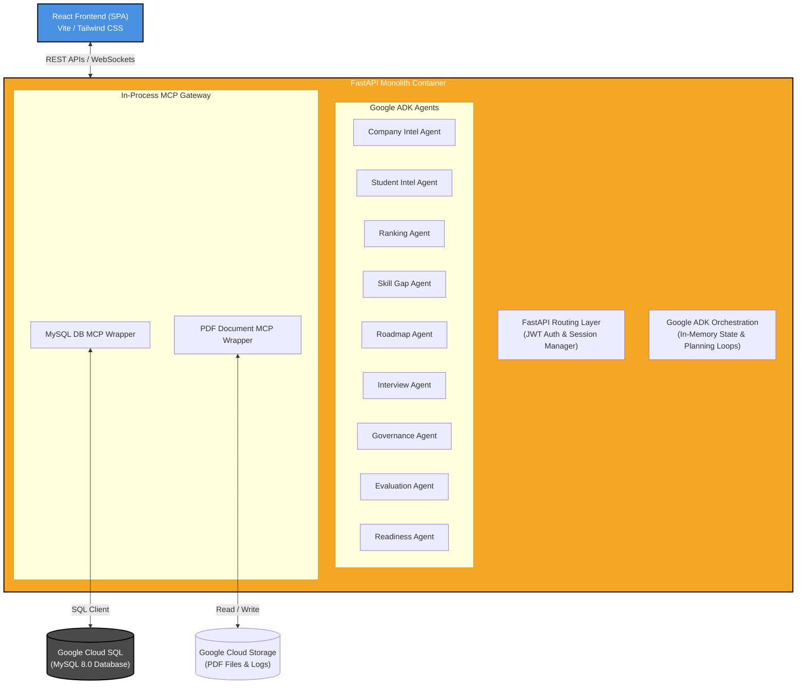
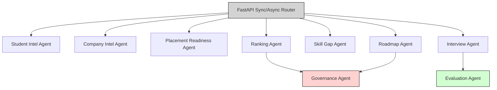
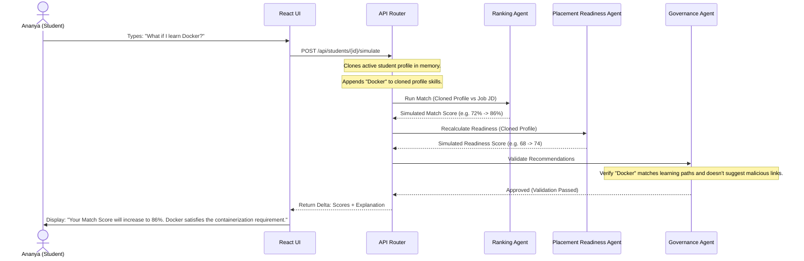

# Refined System Architecture: Placement Intelligence Platform (PIP)
## Solo-Developer MVP Spec and Kaggle Capstone Design

---

## 1. Refined MVP Architecture (Simplified Infrastructure)

To accelerate development and ease deployment for a solo developer, the infrastructure is simplified from a distributed event-driven microservices setup to a **Classic Monolithic 3-Tier Web Architecture**.



### Why it exists
By placing the API endpoints, Google ADK orchestration, worker agents, and Model Context Protocol (MCP) wrappers inside a single **FastAPI container**, we eliminate the need for an external API gateway, Pub/Sub event brokers, and container orchestration overhead (like Kubernetes).

### What problem it solves
It solves the deployment and debugging complexity. A solo developer can run the entire backend locally with a single `python main.py` or docker-compose setup, keeping development velocity high while maintaining the same agent capabilities.

### Kaggle Concept
*   **Day 5 (Productionization & Cloud Deployment):** Deploying a streamlined containerized API monolith onto Google Cloud Run, backed by a single Cloud SQL database instance.

---

## 2. Updated Agent Architecture

The agent structure is streamlined to focus on immediate core deliverables:



*   **Placement Readiness Agent:** The centerpiece. It aggregates academic GPA, project complexity scores (extracted from portfolio documents or GitHub), communication scores, and interview performance logs into a unified metric.
*   **Ranking Agent (Simulation Enabled):** Matches candidates against JDs and handles "What-If" simulation requests.
*   **Governance Agent:** Redacts PII during ranking runs, validates that the What-If recommendations are feasible, and writes manual shortlist modifications to an audit trail.

---

## 3. Placement Readiness Architecture (Hero Feature)

The **Placement Readiness Score** is the central metric of the platform, linking the Student, Recruiter, and Placement Officer dashboards.

```
       +-----------------------------------------------------------------+
       |                  Placement Readiness Score                      |
       |                           72/100                                |
       +-----------------------------------------------------------------+
          /                        |                   \
         /                         |                    \
        v                          v                     v
 [ Student Dashboard ]    [ Recruiter Dashboard ]   [ Placement Officer ]
  - Skill breakdown        - Pool averages           - College metrics
  - Improvement list       - Skill distributions     - Department comparisons
  - Roadmap generation     - Top candidate alerts    - Progress trends
```

### 3.1. Scoring Algorithm
The score is computed by the `Placement Readiness Agent` using a weighted aggregation of extracted and evaluated attributes:
$$\text{Readiness Score} = 0.30(\text{Technical Skill Index}) + 0.30(\text{Project Portfolio Index}) + 0.20(\text{Communication Index}) + 0.20(\text{Mock Interview Index})$$

*   **Technical Skill Index (0-100):** Extracted by the `Student Intel Agent` (courses completed, GPA, verified programming language profiles).
*   **Project Portfolio Index (0-100):** Graded based on project documents, architecture diagrams, or GitHub metadata parsed by the PDF/GitHub MCP wrappers.
*   **Communication Index (0-100):** Computed from mock interview transcript text characteristics (clarity, structure, conciseness).
*   **Mock Interview Index (0-100):** Average score across technical interview questions answered by the student.

### 3.2. Dashboard Integrations
1.  **Student Dashboard:** Renders the 0-100 dial, a radar chart of the 4 dimensions, and a list of specific "Improvement Suggestions" (e.g., *"Complete a project using Docker to increase your Project Portfolio score by 12 points"*).
2.  **Recruiter Dashboard:** Displays the **Average Candidate Readiness** for a matching pool, a distribution histogram showing the concentration of top-tier talent, and a quick-list of "High Readiness Candidates" matching specific keyword filters.
3.  **Placement Officer Dashboard:** Provides the **College Readiness Score**, a comparative bar chart showing department scores (e.g., Computer Science: 76, IT: 70, Electrical: 61), and a line chart of weekly readiness trends to evaluate the impact of placement roadmaps.

---

## 4. What-If Simulation Architecture

The **What-If Simulation** allows students to see the impact of acquiring skills before applying for roles or investing time in courses.



### Simulation Mechanics
*   **Orchestration:** The API endpoint `POST /api/students/{id}/simulate` acts as the execution coordinator.
*   **Score Delta Calculation:** The system compares the active DB match records with the mock in-memory run output.
*   **Explanation Generation:** The `Skill Gap Agent` matches the added skills to the missing components of the JD, generating structured text describing which gaps were resolved.
*   **Validation:** The `Governance Agent` inspects the recommendation output to ensure it does not suggest unverified resources, third-party sales links, or violate prompt safety guidelines.

---

## 5. Recruiter Intelligence Architecture

Instead of presenting recruiters with simple lists of resumes, PIP provides a **Recruiter Analytics Dashboard** using aggregated database metrics:

```
+-----------------------------------------------------------------------+
|                       RECRUITER ANALYTICS                             |
+-----------------------------------------------------------------------+
|  Pool Size: 142 Candidates          |  Avg. Match Score: 78%          |
|  Avg. Readiness Score: 81%          |  Shortlist Confidence: High     |
+-------------------------------------+---------------------------------+
|  Top Missing Skills:                |  Competitive Departments:       |
|  1. AWS (45% lack it)               |  1. Computer Science (Avg 84)   |
|  2. Docker (38% lack it)            |  2. Information Tech (Avg 78)   |
+-----------------------------------------------------------------------+
```

### Components
*   **Candidate Pool Size:** Displays total active profiles matching the job's minimum GPA and role criteria.
*   **Average Match Score:** Compares the aggregate compatibility of the pool against the JD.
*   **Average Readiness Score:** Pulls from the `Placement Readiness` table to show the general placement preparedness of applicants.
*   **Top Missing Skills:** Runs an aggregation query on the `MATCHES` gap details column to find the most common missing technical competencies.
*   **Shortlist Confidence Metric:** Calculated based on the percentage of candidate matching reports that do *not* contain "Low Confidence" indicators from the Student Intel Agent.

---

## 6. Simplified Deployment Architecture

PIP is packaged into a dual-container setup that is easily deployed on Google Cloud Platform:

```
                            [ Web Browser ]
                                   |
                     +-------------+-------------+
                     | HTTPS                     | WebSockets (Mock Interviews)
                     v                           v
             [ Google Cloud Run: FastAPI Backend Container ]
               - FastAPI Endpoints
               - Google ADK Agents & Orchestration
               - Static React Frontend Files (built & served from backend/static)
                                   |
                     +-------------+-------------+
                     |                           |
                     v                           v
       [ Google Cloud SQL (MySQL) ]     [ Google Cloud Storage ]
        - Persistent Tables              - Uploaded Resumes
        - Match logs & Audit logs        - Saved Interview Transcripts
```

*   **Single Cloud Run Service:** The backend container is built with both FastAPI and the compiled React assets (placed in `backend/app/static`). FastAPI serves the compiled React app directly via `StaticFiles`. This completely bypasses CORS issues, eliminates the need for separate hosting services (like Firebase or Vercel), and keeps cloud costs low.
*   **Cloud SQL (MySQL 8.0):** Relational database storage.
*   **Cloud Storage:** Stores raw resumes (PDFs) and mock interview transcript records.

---

## 7. Future Enhancements (Deferred MVP Items)

To guarantee hackathon delivery, the following features are moved to the future roadmap:

| Deferred Item | Why Deferred for MVP | MVP Alternative |
| :--- | :--- | :--- |
| **Full GitHub Verification Engine** | Parsing repo histories and validating commits is resource-heavy, prone to API rate limits, and requires OAuth setup. | Optional simple repository check. If provided, checks basic public API repository stats; otherwise, relies on self-reported portfolios. |
| **Advanced Bias Detection** | Building comprehensive demographic parity checkers requires extensive test datasets and validation models. | Anonymize candidate matching lists by stripping names, emails, and genders before processing. |
| **LMS Integrations** | University LMS platforms (Canvas, Blackboard) use varied custom LTI integrations, which are complex to establish. | Pre-configured internal course library stored as a static mock table in MySQL. |
| **Complex Pub/Sub Workflows** | Implementing asynchronous queue handlers (like Celery/RabbitMQ) adds deployment complexity. | Async Python loops utilizing FastAPI `BackgroundTasks`. |
| **Multiple MCP Servers** | Running separate MCP containers requires managing multiple network connections and configurations. | Implement MCP logic directly inside backend python helpers (In-Process Tools). |
| **Multi-Region Deployment** | Deploying databases and APIs across multiple zones increases cloud costs and synchronization issues. | Single-region deployment on GCP (e.g., `us-central1`). |

---

## 8. Day 1–5 Concept Coverage Matrix

This matrix maps Kaggle AI Agent course concepts directly to system components:

| Day | Kaggle Concept | System Implementation Detail / Location |
| :--- | :--- | :--- |
| **Day 1**| **Agentic Engineering** | State loops within the [Interview Agent](file:///c:/projects/Placement-intelligence/ARCHITECTURE_REFINED.md#2-updated-agent-architecture) managing turn-taking and assessment. |
| | **Factory Model** | Dynamically spawning targeted mock interview sessions inside [FastAPI Route helpers](file:///c:/projects/Placement-intelligence/ARCHITECTURE_REFINED.md#11-api-architecture-restful-endpoints) based on target JDs. |
| **Day 2**| **Model Context Protocol (MCP)** | Decoupling agent actions from database access via in-process database tool definitions. |
| | **Agent-to-Agent Comm.** | Structured JSON exchanges passing through the orchestrator to pass parsed candidate details to the match loops. |
| **Day 3**| **Skills** | Modular wrappers (e.g., `DocParsingSkill`, `InterviewGradingSkill`) that can be bound to different agents. |
| | **Progressive Disclosure** | UI disclosure path: Dashboard Readiness Score $\rightarrow$ Gaps $\rightarrow$ Roadmap Calendar $\rightarrow$ Mock Prep Session. |
| **Day 4**| **Security** | PII stripping before matches occur, protecting student identity; API rate limits in FastAPI. |
| | **Human-in-the-Loop** | Intercepting match lists, placing them in the Placement Officer approval queue prior to recruiter release. |
| | **Evaluation** | Using the `Evaluation Agent` as an LLM-as-a-judge to grade generated matched explanations (1-5 scale). |
| **Day 5**| **Spec-Driven Dev.** | Enforcing JSON schema validation files (`student_profile.json`, `roadmap.json`) for agent boundaries. |
| | **Productionization** | Cost/token tracking per match; centralized Python logging; deployment via Docker on GCP. |

---

## 9. Updated Folder Structure

Below is the consolidated, monorepo directory tree for the refined MVP:

```
placement-intelligence-platform/
├── .agents/                        # Local rules and instructions
├── backend/                        # Combined FastAPI + React static files
│   ├── app/
│   │   ├── api/                    # REST routers (students, recruiters, simulation)
│   │   ├── core/                   # Orchestrator & in-memory board state
│   │   ├── db/                     # SQLAlchemy models & connection configs
│   │   ├── agents/                 # Google ADK agent configurations
│   │   │   ├── readiness_agent.py
│   │   │   ├── ranking_agent.py
│   │   │   └── base.py
│   │   ├── skills/                 # ADK skills (PDF extraction, SQL querying)
│   │   └── main.py
│   ├── static/                     # Built frontend files (React production bundle)
│   ├── Dockerfile
│   └── requirements.txt
├── frontend/                       # React 18 frontend code
│   ├── src/
│   │   ├── components/             # Dashboard Widgets (Readiness gauges, simulation panels)
│   │   ├── views/                  # Portals (Student, Recruiter, Placement Officer)
│   │   └── main.jsx
│   ├── package.json
│   └── vite.config.js
└── docker-compose.yml              # Local testing environment (FastAPI + local MySQL)
```

---

## 10. Updated Implementation Roadmap

A phased, solo-developer timeline to deliver a working project:

```
   Phase 1               Phase 2               Phase 3               Phase 4               Phase 5
+-----------+         +-----------------+         +-------------+         +---------------+         +---------------+
| DB & API  | ------> | Agent Parsing   | ------> | Readiness & | ------> | Mock Interview| ------> | HITL & Cloud  |
| Skeleton  |         | & Matching      |         | Roadmaps    |         | & What-If Sim |         | Deployment    |
+-----------+         +-----------------+         +-------------+         +---------------+         +---------------+
  Week 1                Week 2                Week 3                Week 4                Week 5
```

### Phase 1: DB & API Skeleton (Week 1)
*   Set up MySQL schemas and Docker-compose local databases.
*   Build FastAPI router skeletons for Student, Recruiter, and Placement Officer dashboards.
*   Initialize Vite React project with layout pages.

### Phase 2: Agent Parsing & Matching (Week 2)
*   Implement `Student Intel Agent` and `Company Intel Agent` using Google ADK.
*   Integrate PDF extraction tools to parse resumes and JDs.
*   Build the core matching calculations inside the `Ranking Agent`.

### Phase 3: Readiness & Roadmaps (Week 3)
*   Build the `Placement Readiness Agent` to aggregate scores and output JSON breakdowns.
*   Integrate the `Career Roadmap Agent` to generate study calendars.
*   Hook up the Progressive Disclosure UI components in React.

### Phase 4: Mock Interview & What-If (Week 4)
*   Build the `Interview Agent` chat interface using WebSockets.
*   Implement the `What-If Simulation` logic in the FastAPI router and Ranking Agent.
*   Add the Recruiter Analytics view to the frontend.

### Phase 5: HITL & Cloud Deployment (Week 5)
*   Enforce Governance check-points (Placement Officer queue, audit logs).
*   Run Evaluation runs (NDCG calculations, LLM-as-a-judge audits).
*   Build the monorepo Docker image and deploy to Google Cloud Run.
