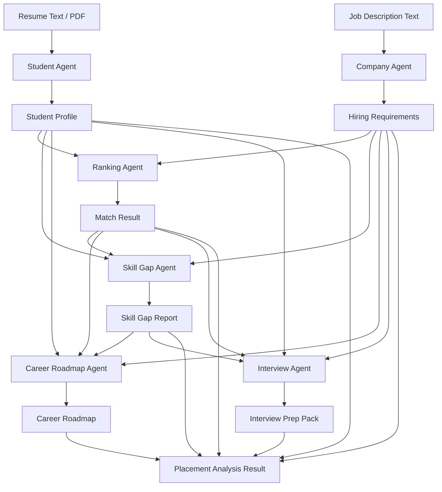
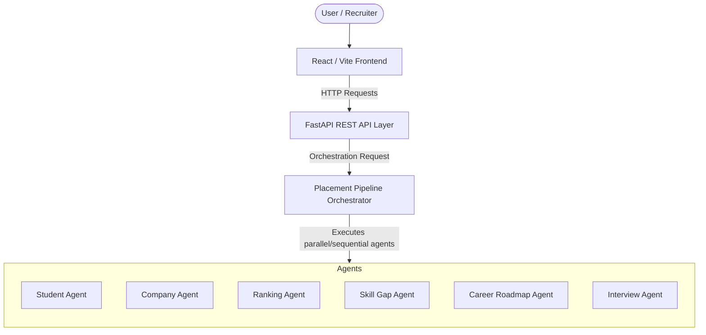

# Placement Intelligence Platform Architecture

This document describes the architectural layout, components, and data flow pipelines of the Placement Intelligence Platform (PIP).

## Overview

PIP is a multi-agent system designed to analyze resumes and job descriptions to provide structured match scores, skill gap reports, career roadmaps, and interview preparation packages.

## System Integration Stack

The flow of requests from the user interface down to the specialized LLM intelligence agents is structured as follows:

## Agent Coordination Details

1. **Student Agent**: Extracts normalized tech skills, experience levels, certifications, and educational credentials from student resumes.
2. **Company Agent**: Extracts target roles, core tech stack keywords, minimum experience, and required/preferred credentials from job descriptions.
3. **Ranking Agent**: Computes semantic match scores and maps student profiles against job descriptions.
4. **Skill Gap Agent**: Performs a detailed comparison of student skills versus job requirements, categorizing gaps and identifying missing skills.
5. **Career Roadmap Agent**: Produces actionable learning milestones, target timelines, and resource recommendations to close identified gaps.
6. **Interview Agent**: Generates tailored behavioral and technical questions, reference answers, evaluation rubrics, and overall preparation guidance.
